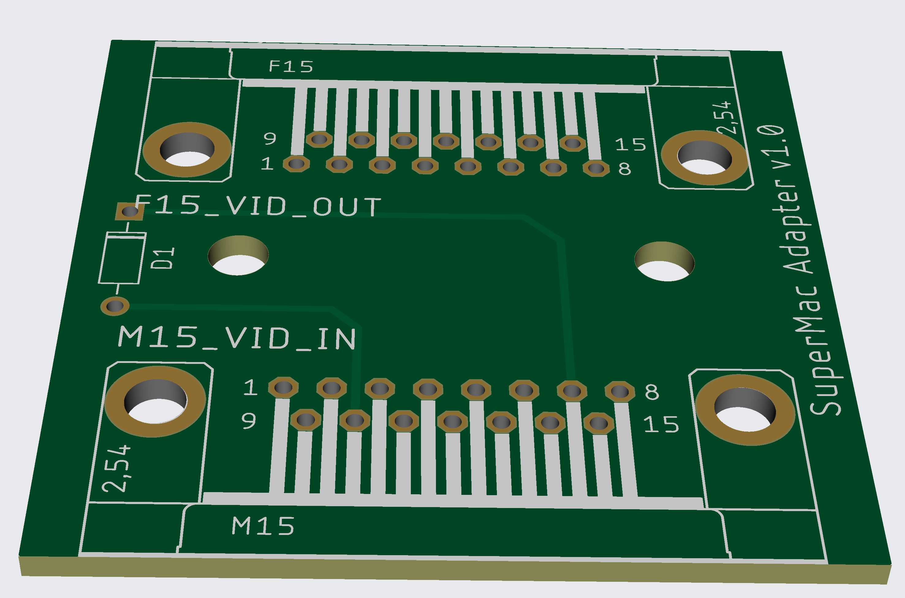
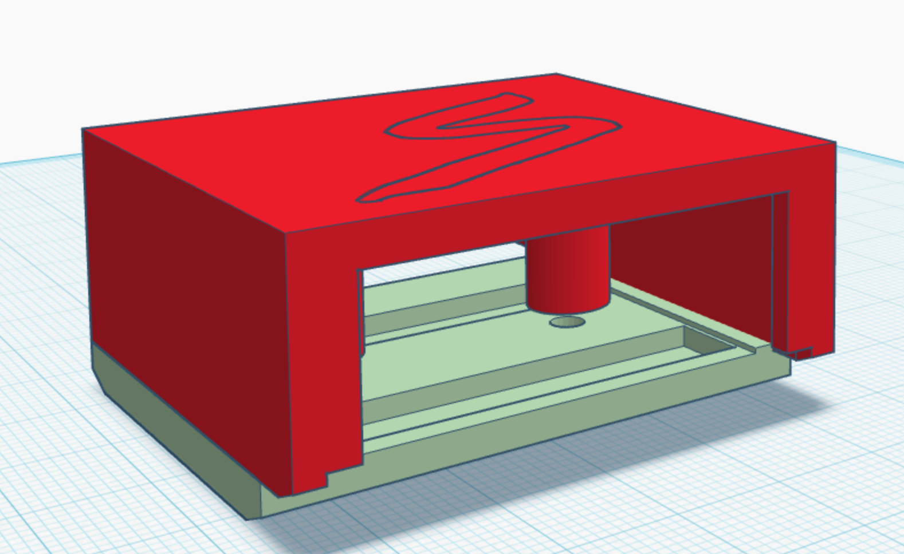

# SuperMac-DA-15-Adapter
Adapter that allows SuperMac SuperMatch monitor to connect to a Mac with a standard DA-15 port

## Adapter 

SuperMac monitors were made to work with SuperMac video cards on vintage Macintosh computers.  However, I believe they used to come with an adapter that allowed you to use them with a standard Mac video output using the DA-15 connector.  This adapter replicates what I believe that adapter was doing, which is providing the sense lines to tell the Mac what resolutions and refresh rates are supported.  

## Why did I make this adapter
I recently picked up a SuperMac SuperMatch 17-1 monitor, and it had what appeared to be a DA-15 connector on the end, so I tried plugging it into one of my Macintosh computers that had a DA-15 video connector.  Unfortunately, this produced no images or signs of life on the SuperMac Monitor.  However, I noticed the DA-15 connector from the monitor was missing some pins.  I originally feared these pins had fallen off due to corrosion, but after asking on the TinkerDifferent forums, they believed the SuperMac monitors had been built to be paired with SuperMac video cards, and the monitors may lack the sense line logic that was present on Apple monitors.  When I compared the missing pins to a pinout for the DA-15 connector, sure enough the missing pins corresponded with the sense lines on the connector.  With that in mind, I suspected that the lack of sense lines caused the Mac to not send a proper resolution and refresh rate, causing the lack of picture.  

If that was the case, grounding one of the sense lines and adding a diode to the other two should give me a choice of resolution options on the Mac that hopefully will all be supported on the SuperMac display.  I wired up a prototype and tested it out and was rewarded with an image on the CRT.  This PCB is the cleaned up version of that prototype. In order to make it, you'll a PCB (I used JLCPCB), a male DA-15 connector, a female DA-15 connector, and a diode. 

### BOM

| Component | Source |
| --- | --- |
| 1N4007 Diode | [Amazon](https://a.co/d/5SRJu1n) |
| Amphenol L717SDA15P1ACH4R Male Right Angle DA-15 Connector | [Mouser](https://www.mouser.com/ProductDetail/Amphenol-Commercial-Products/L717SDA15P1ACH4R?qs=wLKqLMNa9uJ5jVb3DK5E9g%3D%3D) |
| Amphenol LD15S24A4GX00LF Female Right Angle DA-15 Connector | [Mouser](https://www.mouser.com/ProductDetail/Amphenol-Commercial-Products/L77SDA15S1ACH3R?qs=mq7kV%2Fq8lk7uum6rh5TyHg%3D%3D) |
| 2ea M3 x 8 screws | [Amazon](https://www.amazon.com/dp/B0BMQGV4SW?ref=ppx_yo2ov_dt_b_fed_asin_title&th=1) |

## Case

I also made a 3d printable case to hold it, and it has been tested on a Quadra 650.  It may not work with other Macintosh cases that may have obstructions aroudn the DA-15 port, so you may need to use it as a bare PCB.  Here is the what the case looks like, with a portion notched out to not interfere with plugging the adapter into the Quadra 650 case

